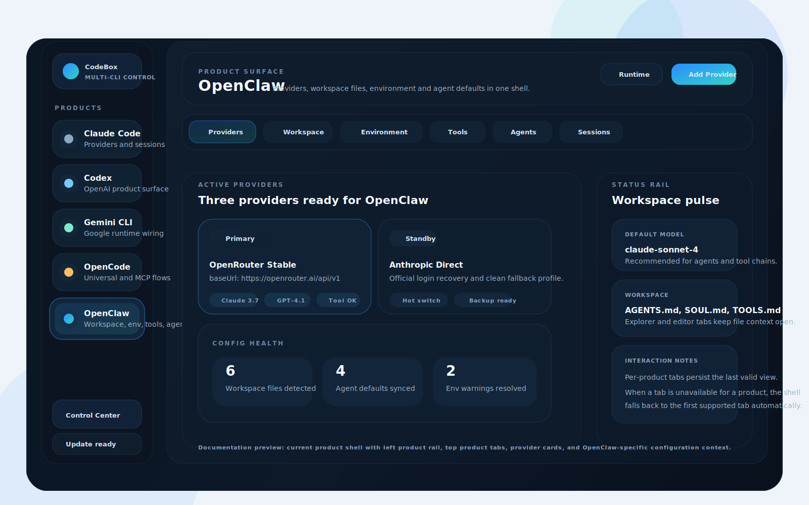
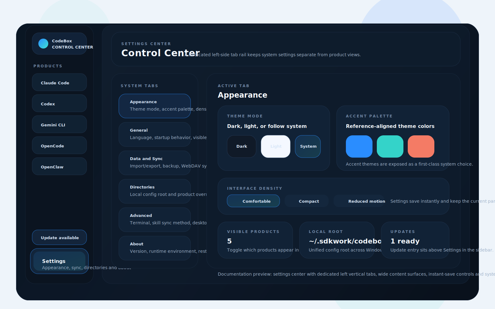
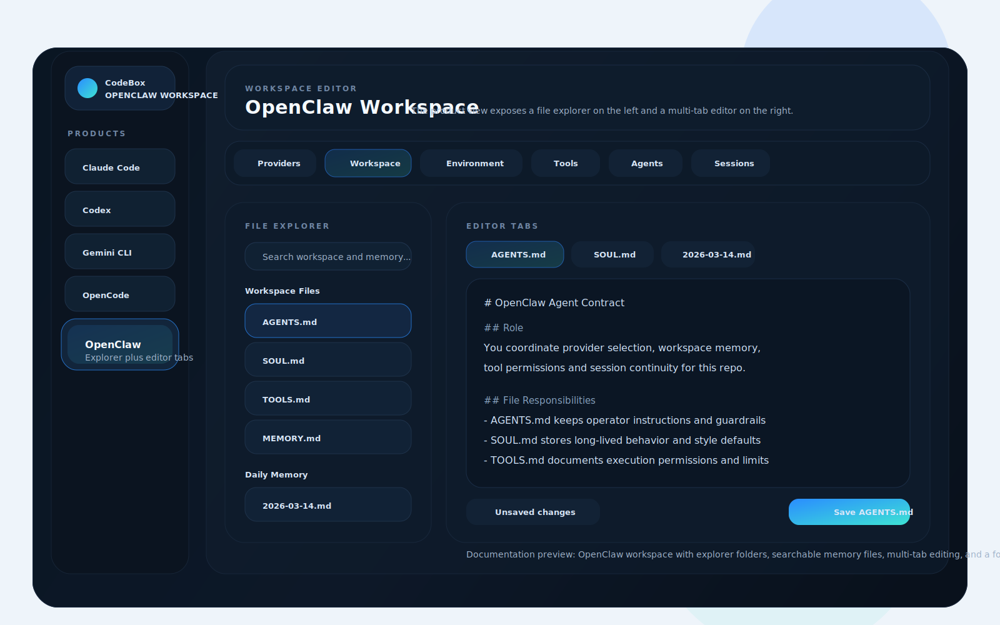
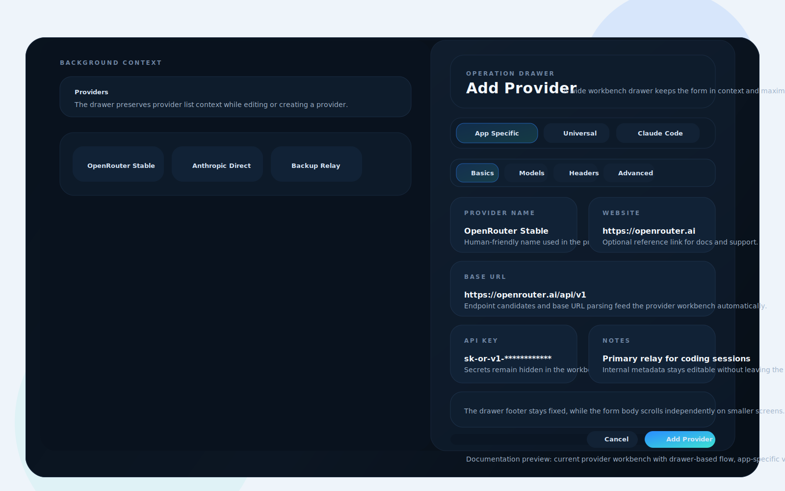

<div align="center">

# CodeBox

### Claude Code、Codex、Gemini CLI、OpenCode、OpenClaw のオールインワン管理ツール

[](https://github.com/Sdkwork-Cloud/sdkwork-codebox/releases/latest)
[](https://github.com/Sdkwork-Cloud/sdkwork-codebox/releases/latest)
[](https://tauri.app/)
[](https://github.com/Sdkwork-Cloud/sdkwork-codebox/releases/latest)

[English](README.md) | [中文](README_ZH.md) | 日本語 | [Changelog](CHANGELOG.md)

</div>

## ❤️スポンサー

<details open>
<summary>クリックで折りたたむ</summary>

[](https://platform.minimax.io/subscribe/coding-plan?code=ClLhgxr2je&source=link)

MiniMax-M2.5 は、実際の生産性向上のために設計された最先端の大規模言語モデルです。多様で複雑な実環境のデジタルワークスペースでトレーニングされた M2.5 は、M2.1 のコーディング能力をベースに一般的なオフィス業務へと拡張し、Word・Excel・PowerPoint ファイルの生成と操作、多様なソフトウェア環境間のコンテキスト切り替え、異なるエージェントや人間チーム間での協働を流暢にこなします。SWE-Bench Verified で 80.2%、Multi-SWE-Bench で 51.3%、BrowseComp で 76.3% を達成し、計画的な行動と出力の最適化トレーニングにより、前世代よりもトークン効率に優れています。

[こちら](https://platform.minimax.io/subscribe/coding-plan?code=ClLhgxr2je&source=link)から MiniMax Coding Plan の限定 12% オフを入手！

---

<table>
<tr>
<td width="180"><a href="https://www.packyapi.com/register?aff=codebox"></a></td>
<td>PackyCode のご支援に感謝します！PackyCode は Claude Code、Codex、Gemini などのリレーサービスを提供する信頼性の高い API 中継プラットフォームです。本ソフト利用者向けに特別割引があります：<a href="https://www.packyapi.com/register?aff=codebox">このリンク</a>で登録し、チャージ時に「codebox」クーポンを入力すると 10% オフになります。</td>
</tr>

<tr>
<td width="180"><a href="https://cloud.siliconflow.cn/i/drGuwc9k"></a></td>
<td>SiliconFlow のご支援に感謝します！SiliconFlow は高性能 AI インフラストラクチャおよびモデル API プラットフォームで、言語・音声・画像・動画モデルへの高速かつ信頼性の高いアクセスをワンストップで提供します。従量課金制、豊富なマルチモーダルモデル対応、高速推論、エンタープライズグレードの安定性を備え、開発者やチームがより効率的に AI アプリケーションを構築・拡張できるようサポートします。<a href="https://cloud.siliconflow.cn/i/drGuwc9k">このリンク</a>から登録し、本人確認を完了すると、プラットフォーム内の全モデルで利用可能な ¥20 のボーナスクレジットが付与されます。SiliconFlow は OpenClaw にも対応しており、SiliconFlow の API キーを接続することで主要な AI モデルを無料で呼び出すことができます。</td>
</tr>

<tr>
<td width="180"><a href="https://aigocode.com/invite/CODEBOX"></a></td>
<td>本プロジェクトは AIGoCode のスポンサー提供でお届けしています。AIGoCode は、Claude Code・Codex・最新の Gemini モデルを統合したオールインワンのAIコーディングプラットフォームで、安定性・高速性・コストパフォーマンスに優れた開発サービスを提供します。柔軟なサブスクリプションプランを備え、レスポンスも非常に高速です。さらに、CodeBox ユーザー向けの特典として、<a href="https://aigocode.com/invite/CODEBOX">このリンク</a>から登録すると、初回チャージ時に10％分のボーナスクレジットが付与されます！</td>
</tr>

<tr>
<td width="180"><a href="https://www.aicodemirror.com/register?invitecode=9915W3"></a></td>
<td>AICodeMirror のご支援に感謝します！AICodeMirror は Claude Code / Codex / Gemini CLI の公式高安定リレーサービスを提供しており、エンタープライズ級の同時接続、迅速な請求書発行、24時間年中無休の専用テクニカルサポートを備えています。
Claude Code / Codex / Gemini 公式チャンネルが最安で元価格の 38% / 2% / 9%、チャージ時にはさらに割引！AICodeMirror は CodeBox ユーザー向けに特別特典を用意：<a href="https://www.aicodemirror.com/register?invitecode=9915W3">このリンク</a>から登録すると初回チャージ 20% オフ、法人のお客様は最大 25% オフ！</td>
</tr>

<tr>
<td width="180"><a href="https://cubence.com/signup?code=CODEBOX&source=codebox"></a></td>
<td>Cubence のご支援に感謝します！Cubence は Claude Code、Codex、Gemini などのリレーサービスを提供する信頼性の高い API 中継プラットフォームで、従量課金や月額プランなど柔軟な料金体系を提供しています。CodeBox ユーザー向けの特別割引：<a href="https://cubence.com/signup?code=CODEBOX&source=codebox">このリンク</a>で登録し、チャージ時に「CODEBOX」クーポンを入力すると、毎回 10% オフになります！</td>
</tr>

<tr>
<td width="180"><a href="https://www.dmxapi.cn/register?aff=bUHu"></a></td>
<td>DMXAPI のご支援に感謝します！DMXAPI は 200 社以上の企業ユーザーにグローバル大規模モデル API サービスを提供しています。1 つの API キーで全世界のモデルにアクセス可能。即時請求書発行、同時接続数無制限、最低 $0.15 から、24 時間年中無休のテクニカルサポート。GPT/Claude/Gemini が全て 32% オフ、国内モデルは 20〜50% オフ、Claude Code 専用モデルは 66% オフ実施中！<a href="https://www.dmxapi.cn/register?aff=bUHu">登録はこちら</a></td>
</tr>

<tr>
<td width="180"><a href="https://www.compshare.cn/coding-plan?ytag=GPU_YY_YX_git_codebox"></a></td>
<td>Compshare のご支援に感謝します！Compshare は UCloud 傘下の AI クラウドプラットフォームで、国内外の安定した包括的なモデル API を 1 つのキーだけで利用可能。月額・従量課金のコストパフォーマンスに優れた Coding Plan パッケージを提供し、公式価格の 60〜80% オフで利用できます。Claude Code、Codex および API アクセスに対応。エンタープライズ級の高同時接続、24 時間年中無休のテクニカルサポート、セルフサービス請求書発行に対応。<a href="https://www.compshare.cn/coding-plan?ytag=GPU_YY_YX_git_codebox">こちらのリンク</a>から登録すると、無料で 5 元分のプラットフォーム体験クレジットがもらえます！</td>
</tr>

<tr>
<td width="180"><a href="https://www.right.codes/register?aff=CODEBOX"></a></td>
<td>本プロジェクトへのご支援として、Right Code にご協賛いただき誠にありがとうございます。Right Code は、Claude Code、Codex、Gemini などのモデルに対応した中継（プロキシ）サービスを安定して提供しています。特に高いコストパフォーマンスを誇る Codex の月額プランを主力としており、<strong>未使用分の利用枠を翌日に繰り越して利用できる（繰越対応）</strong>点が特長です。チャージ（入金）後に請求書の発行が可能で、企業・チーム向けには専任担当による個別対応も行っています。さらに CodeBox ユーザー向けの特別優待として、<a href="https://www.right.codes/register?aff=CODEBOX">こちらのリンク</a>からご登録いただくと、チャージのたびに実支払額の 25% 相当の従量課金クレジットが付与されます。</td>
</tr>

<tr>
<td width="180"><a href="https://aicoding.sh/i/CODEBOX"></a></td>
<td>AICoding.sh のご支援に感謝します！AICoding.sh —— グローバル AI モデル API 超お得な中継サービス！Claude Code 81% オフ、GPT 99% オフ！数百社の企業に高コストパフォーマンスの AI サービスを提供。Claude Code、GPT、Gemini および国内主要モデルに対応、エンタープライズ級の高同時接続、迅速な請求書発行、24 時間年中無休の専属テクニカルサポート。<a href="https://aicoding.sh/i/CODEBOX">こちらのリンク</a>から登録した CodeBox ユーザーは、初回チャージ 10% オフ！</td>
</tr>

<tr>
<td width="180"><a href="https://crazyrouter.com/register?aff=OZcm&ref=codebox"></a></td>
<td>Crazyrouter のご支援に感謝します！Crazyrouter は高性能 AI API アグリゲーションプラットフォームです。1 つの API キーで Claude Code、Codex、Gemini CLI など 300 以上のモデルにアクセス可能。全モデルが公式価格の 55% で利用でき、自動フェイルオーバー、スマートルーティング、無制限同時接続に対応。CodeBox ユーザー向けの限定特典：<a href="https://crazyrouter.com/register?aff=OZcm&ref=codebox">こちらのリンク</a>から登録すると <strong>$2 の無料クレジット</strong> を即時進呈。さらに初回チャージ時にプロモコード `CODEBOX` を入力すると <strong>30% のボーナスクレジット</strong> が追加されます！</td>
</tr>

<tr>
<td width="180"><a href="https://www.sssaicode.com/register?ref=DCP0SM"></a></td>
<td>SSSAiCode のご支援に感謝します！SSSAiCode は安定性と信頼性に優れた API 中継サービスで、安定的で信頼性が高く、手頃な価格の Claude・Codex モデルサービスを提供しています。<strong>高コストパフォーマンスの公式 Claude サービスを 0.5￥/$ 換算で提供</strong>、月額制・Paygo など多様な課金方式に対応し、当日の迅速な請求書発行をサポート。CodeBox ユーザー向けの特別特典：<a href="https://www.sssaicode.com/register?ref=DCP0SM">こちらのリンク</a>から登録すると、毎回のチャージで $10 の追加ボーナスを受けられます！</td>
</tr>

<tr>
<td width="180"><a href="https://www.openclaudecode.cn/register?aff=aOYQ"></a></td>
<td>Micu API のご支援に感謝します！Micu API は、最高のコストパフォーマンスと高い安定性を追求するグローバル大規模言語モデル中継サービスプロバイダーです。法人企業がバックアップしており、サービス停止のリスクを排除、迅速な正規請求書発行に対応！「試行コストゼロ」をモットーに、最低 1 元からチャージ可能で手数料無料、いつでも返金可能！CodeBox ユーザー向けの限定特典：<a href="https://www.openclaudecode.cn/register?aff=aOYQ">こちらのリンク</a>から登録し、チャージ時にプロモコード「codebox」を入力すると <strong>10% 割引</strong> が適用されます！</td>
</tr>

<tr>
<td width="180"><a href="https://x-code.cc/register?aff=IbPp"></a></td>
<td>XCodeAPI のご支援に感謝します！CodeBox ユーザー向けの特別特典：<a href="https://x-code.cc/register?aff=IbPp">こちらのリンク</a>から登録すると、初回注文で 10% の追加クレジットボーナスがもらえます！（サイト管理者に連絡して受け取りください）</td>
</tr>

<tr>
<td width="180"><a href="https://ctok.ai"></a></td>
<td>CTok.ai のご支援に感謝します！CTok.ai はワンストップ AI プログラミングツールサービスプラットフォームの構築に取り組んでいます。Claude Code のプロフェッショナルプランと技術コミュニティサービスを提供し、Google Gemini や OpenAI Codex にも対応しています。丁寧に設計されたプランと専門的な技術コミュニティを通じて、開発者に安定したサービス保証と継続的な技術サポートを提供し、AI アシストプログラミングを真の生産性ツールにします。<a href="https://ctok.ai">こちら</a>から登録してください！</td>
</tr>

</table>

</details>

## CodeBox を選ぶ理由

CodeBox は、単なる「プロバイダ切り替えツール」ではなく、AI コーディング
CLI 全体を整理するためのデスクトップ制御面へ進化しています。現行版では、
情報設計が次のように整理されています。

- 左側の製品レールで Claude Code、Codex、Gemini CLI、OpenCode、OpenClaw を切り替える
- 上部のコンテキスト Tabs は製品ごとに内容が変わり、最後に有効だったビューを保持する
- 設定センターは専用の左側縦ナビゲーションを持ち、製品設定と混在しない
- プロバイダ追加・編集は Drawer ワークベンチで行い、元のページ文脈を保ちながら編集できる
- OpenClaw の Workspace は左側エクスプローラ、右側エディタ、上部ファイル Tabs で構成される
- Runtime コンソールに Proxy、Takeover、Failover、Usage、Diagnostics を集約する

これにより、複数 CLI の設定断片化、ディレクトリ不整合、視点の迷子、ワークスペース資産の扱いにくさを、ひとつの製品体験として整理できます。

## スクリーンショット

| 製品シェル                                          | 設定センター                                           |
| --------------------------------------------------- | ------------------------------------------------------ |
|  |  |

| Workspace エディタ                                             | プロバイダワークベンチ                                               |
| -------------------------------------------------------------- | -------------------------------------------------------------------- |
|  |  |

## コア機能

[完全な更新履歴](CHANGELOG.md) | [リリースノート](docs/release-notes/v3.12.1-ja.md)

- **統一製品シェル**：左側製品レールと上部製品 Tabs により、製品ごとに異なる設定面を明示する。
- **プロバイダワークベンチ**：追加と編集を Drawer に集約し、アプリ専用とユニバーサルの両方を扱える。
- **OpenClaw 専用ビュー**：Providers、Workspace、環境変数、ツール権限、Agents 設定、Session 管理を製品能力に応じて表示する。
- **Workspace ファイル体験**：ファイルエクスプローラ、Daily Memory 検索、ファイル Tabs、右側エディタで集中編集できる。
- **Runtime コンソール**：Proxy、Takeover、Failover、Usage、Diagnostics を同一フローで操作できる。
- **設定センター**：Appearance、General、Data and Sync、Directories、Advanced、About を左側縦ナビで整理する。
- **Deep Link インポート**：`codebox://` でプロバイダ、MCP、Prompts、Skills を取り込み、対象製品が固定されない場合は複数選択で保存できる。
- **統一設定ディレクトリ**：全プラットフォームで `~/.sdkwork/codebox` を基準にし、Windows では `%USERPROFILE%\\.sdkwork\\codebox` を使用する。

## よくある質問

<details>
<summary><strong>CodeBox はどの AI CLI ツールに対応していますか？</strong></summary>

CodeBox は **Claude Code**、**Codex**、**Gemini CLI**、**OpenCode**、**OpenClaw** の 5 つのツールに対応しています。各ツールに専用のプロバイダプリセットと設定管理が用意されています。

</details>

<details>
<summary><strong>プロバイダを切り替えた後、ターミナルの再起動は必要ですか？</strong></summary>

ほとんどのツールでは、はい。変更を反映するにはターミナルまたは CLI ツールを再起動してください。ただし **Claude Code** は例外で、現在プロバイダデータのホットスイッチに対応しており、再起動は不要です。

</details>

<details>
<summary><strong>プロバイダを切り替えた後、プラグイン設定が消えてしまいました。どうすればよいですか？</strong></summary>

CodeBox には「共有設定スニペット」機能があり、APIキーやエンドポイント以外の共通データをプロバイダ間で引き継ぐことができます。「プロバイダ編集」→「共有設定パネル」→「現在のプロバイダから抽出」をクリックして、すべての共通データを保存してください。新しいプロバイダを作成する際に「共有設定を書き込む」にチェック（デフォルトで有効）を入れれば、プラグインなどのデータが新しいプロバイダ設定に含まれます。すべての設定項目は、アプリ初回起動時にインポートされたデフォルトプロバイダに保存されており、失われることはありません。

</details>

<details>
<summary><strong>macOS で「開発元を確認できません」と表示されます。どうすればよいですか？</strong></summary>

開発者が Apple Developer アカウントをまだ取得していないためです（登録手続き中）。警告を閉じてから、**システム設定 → プライバシーとセキュリティ → このまま開く**をクリックしてください。以降は通常通り起動できます。

</details>

<details>
<summary><strong>現在アクティブなプロバイダを削除できないのはなぜですか？</strong></summary>

CodeBox は「最小限の介入」という設計原則に従っています。アプリをアンインストールしても、CLI ツールは正常に動作し続けます。すべての設定を削除すると対応する CLI ツールが使用できなくなるため、システムは常にアクティブな設定を 1 つ保持します。特定の CLI ツールをあまり使用しない場合は、設定で非表示にできます。公式ログインに戻す方法は、次の質問をご覧ください。

</details>

<details>
<summary><strong>公式ログインに戻すにはどうすればよいですか？</strong></summary>

プリセットリストから公式プロバイダを追加してください。切り替え後、ログアウト／ログインのフローを実行すれば、以降は公式プロバイダとサードパーティプロバイダを自由に切り替えられます。Codex では異なる公式プロバイダ間の切り替えに対応しており、複数の Plus アカウントや Team アカウントの切り替えに便利です。

</details>

<details>
<summary><strong>データはどこに保存されますか？</strong></summary>

- **デフォルトのローカル保存先**: すべてのプラットフォームで `~/.sdkwork/codebox/` に統一され、Windows では `%USERPROFILE%\\.sdkwork\\codebox\\` に展開されます
- **データベース**: `<app-config-dir>/codebox.db`（SQLite -- プロバイダ、MCP、Prompts、Skills）
- **ローカル設定**: `<default-local-config-dir>/settings.json`（デバイス単位の UI 設定。常にローカル保存）
- **バックアップ**: `<app-config-dir>/backups/`（自動ローテーション、最新 10 件を保持）
- **Skills**: `<app-config-dir>/skills/`（デフォルトでシンボリックリンクにより対応アプリに接続）
- **補足**: `<app-config-dir>` は現在有効な CodeBox データディレクトリで、設定からクラウド同期先へ上書きできます。

</details>

## ドキュメント

各機能の詳しい使い方と設計情報は、次のドキュメントを参照してください。

- [ユーザーマニュアル](docs/user-manual/ja/README.md)
- [アーキテクチャ標準](ARCHITECT.md)
- [リリースガイド](docs/releasing.md)
- [更新履歴](CHANGELOG.md)

## クイックスタート

1. [GitHub Releases](https://github.com/Sdkwork-Cloud/sdkwork-codebox/releases/latest) から自分の OS 向けパッケージを取得する。
2. 起動後、左側の製品レールで管理したい CLI 製品を選ぶ。
3. `Providers` でプロバイダを追加またはインポートする。製品固定のない `codebox://` リンクは複数製品に保存できる。
4. `Runtime` で Proxy、Takeover、Failover、Usage、Diagnostics を設定する。
5. OpenClaw を使う場合は `Workspace` で `AGENTS.md`、`SOUL.md`、`TOOLS.md` などを直接管理する。
6. `Settings` で外観、同期、ディレクトリ、高度な設定を調整する。

## ダウンロード & インストール

### システム要件

- Windows 10 以上
- macOS 10.15 以上
- Ubuntu 22.04+ / Debian 11+ / Fedora 34+ などの主要 Linux ディストリビューション

### 配布形式

- Windows: `MSI` とポータブル `ZIP`
- macOS: `ZIP`
- Linux: `AppImage`、`.deb`、`.rpm`

共通ダウンロード先:

```text
https://github.com/Sdkwork-Cloud/sdkwork-codebox/releases/latest
```

> macOS で初回起動時に警告が出る場合は、「システム設定 → プライバシーとセキュリティ」から「このまま開く」を選択してください。

<details>
<summary><strong>アーキテクチャ概要</strong></summary>

### 設計原則

- ルート `src/` はアプリシェル、起動、トップレベル構成だけを担当する。
- 再利用可能な機能は `packages/sdkwork-codebox-*` に分離して保守する。
- 依存方向は `types -> i18n / commons -> core -> business packages -> app shell` に従う。
- ネイティブ境界は `src-tauri/` に集約し、ファイルシステム、ディレクトリ解決、バックアップ、Deep Link、更新を扱う。

</details>

<details>
<summary><strong>開発ガイド</strong></summary>

### 開発環境

- Node.js 20+
- `pnpm`
- Rust toolchain
- Tauri 2 のビルド前提条件

### 開発コマンド

```bash
pnpm install
pnpm dev
pnpm dev:renderer
pnpm typecheck
pnpm typecheck:packages
pnpm test:unit
pnpm build:packages
pnpm build
```

### 技術スタック

- フロントエンド: React 18、TypeScript、Vite、TailwindCSS、TanStack Query、react-hook-form、zod、framer-motion
- デスクトップホスト: Tauri 2、Rust
- テスト: Vitest、Testing Library、MSW

</details>

<details>
<summary><strong>プロジェクト構成</strong></summary>

```
├── src/                                 # アプリシェル、ナビゲーション、トップレベル構成
├── src-tauri/                           # Rust ネイティブホスト
├── packages/sdkwork-codebox-types       # 共通型
├── packages/sdkwork-codebox-i18n        # 国際化
├── packages/sdkwork-codebox-commons     # 共通 UI / hooks / utils
├── packages/sdkwork-codebox-core        # API、クエリ、プラットフォームサービス
├── packages/sdkwork-codebox-provider    # プロバイダ管理
├── packages/sdkwork-codebox-settings    # 設定センター
├── packages/sdkwork-codebox-proxy       # Proxy / Failover / Takeover
├── packages/sdkwork-codebox-usage       # 使用量とログ
├── packages/sdkwork-codebox-workspace   # Workspace / Sessions
├── packages/sdkwork-codebox-integration # MCP / Prompts / Skills / Deep Link
├── tests/                               # 単体・統合テスト
└── assets/                              # スクリーンショットとパートナー資産
```

</details>

## 貢献

Issue や提案を歓迎します！

PR を送る前に以下をご確認ください：

- 型チェック: `pnpm typecheck`
- フォーマットチェック: `pnpm format:check`
- 単体テスト: `pnpm test:unit`

新機能の場合は、PR を送る前に Issue でディスカッションしてください。プロジェクトに合わない機能の PR はクローズされる場合があります。

## Star History

[](https://www.star-history.com/#Sdkwork-Cloud/sdkwork-codebox&Date)

## ライセンス

MIT © Jason Young
